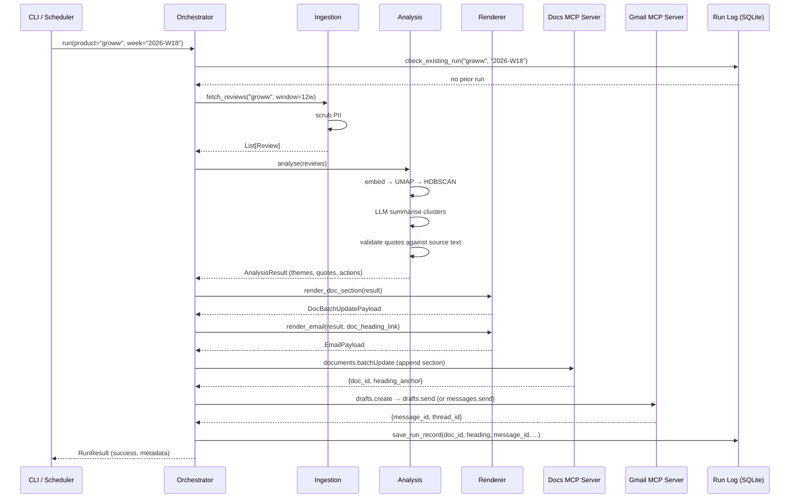

# Weekly Product Review Pulse — Architecture

> **Version:** 1.0 · **Date:** 2026-05-04
> **Companion docs:** [`problem_statement.md`](./problem_statement.md) · `implementationPlan.md` (TBD)

---

## 1. System Overview

The **Review Pulse Agent** is a Python-based AI agent that:

1. **Ingests** public App Store & Google Play reviews for configured fintech products.
2. **Clusters & summarises** feedback into themes, validated quotes, and action ideas using embeddings + UMAP/HDBSCAN + LLM.
3. **Delivers** a one-page weekly pulse report by **appending** to a per-product Google Doc and **emailing** stakeholders with a deep link — both actions executed exclusively through **MCP servers** (Google Docs MCP, Gmail MCP).

The agent acts as an **MCP Host/Client**; it never embeds Google OAuth credentials or calls Docs/Gmail REST APIs directly.

---

## 2. High-Level Architecture Diagram

```
┌─────────────────────────────────────────────────────────────────────────┐
│                        SCHEDULER / CLI TRIGGER                         │
│              (cron — Monday AM IST  ·  CLI backfill mode)              │
└──────────────────────────────┬──────────────────────────────────────────┘
                               │  triggers per (product, iso_week)
                               ▼
┌─────────────────────────────────────────────────────────────────────────┐
│                      AGENT ORCHESTRATOR (Host)                         │
│                                                                        │
│  ┌──────────┐  ┌──────────────┐  ┌──────────────┐  ┌──────────────┐   │
│  │ Ingestion│→ │  Clustering  │→ │  LLM Reason  │→ │   Renderer   │   │
│  │  Module  │  │  Pipeline    │  │  & Validate  │  │  (Doc + Mail)│   │
│  └──────────┘  └──────────────┘  └──────────────┘  └──────┬───────┘   │
│                                                            │           │
│  ┌─────────────────────────────────────────────────────────┼────────┐  │
│  │                    MCP CLIENT LAYER                     │        │  │
│  │  ┌─────────────────────┐   ┌────────────────────────┐   │        │  │
│  │  │  MCP Client: Docs   │   │  MCP Client: Gmail     │   │        │  │
│  │  │  (1:1 session)      │   │  (1:1 session)         │   │        │  │
│  │  └─────────┬───────────┘   └──────────┬─────────────┘   │        │  │
│  └────────────│──────────────────────────│─────────────────┘        │  │
│               │                          │                           │  │
└───────────────│──────────────────────────│───────────────────────────┘  │
                │  JSON-RPC / stdio        │  JSON-RPC / stdio            │
                ▼                          ▼                              │
┌──────────────────────┐    ┌──────────────────────┐                     │
│  Google Docs MCP     │    │  Gmail MCP Server     │                     │
│  Server (external)   │    │  (external process)   │                     │
│                      │    │                       │                     │
│  Tools exposed:      │    │  Tools exposed:       │                     │
│  · documents.get     │    │  · drafts.create      │                     │
│  · documents.batch   │    │  · drafts.send        │                     │
│    Update            │    │  · messages.send      │                     │
│  · documents.create  │    │  · messages.list      │                     │
└──────────┬───────────┘    └──────────┬────────────┘                     │
           │  OAuth 2.0                │  OAuth 2.0                       │
           ▼                           ▼                                  │
    ┌──────────────┐            ┌──────────────┐                          │
    │ Google Docs  │            │    Gmail     │                           │
    │    API       │            │    API       │                           │
    └──────────────┘            └──────────────┘                          │
```

---

## 3. Module Decomposition

### 3.1 Project Structure

```
review_pulse/
├── agent/
│   ├── orchestrator.py        # Main agent loop — coordinates all phases
│   ├── config.py              # Product registry, schedule, feature flags
│   └── idempotency.py         # Run dedup logic (product + iso_week key)
│
├── ingestion/
│   ├── base.py                # Abstract ReviewSource interface
│   ├── appstore.py            # Apple App Store scraper (iTunes RSS / web)
│   ├── playstore.py           # Google Play scraper
│   └── pii_scrubber.py        # Regex + NER-based PII removal
│
├── analysis/
│   ├── embeddings.py          # Text → vector (Sentence-Transformers)
│   ├── clustering.py          # UMAP + HDBSCAN pipeline
│   ├── llm_summariser.py      # Theme naming, quote extraction, actions
│   └── validation.py          # Quote grounding check (exact-match)
│
├── rendering/
│   ├── doc_renderer.py        # Builds Google Docs batchUpdate request body
│   ├── email_renderer.py      # Builds HTML + plain-text email body
│   └── templates/             # Jinja2 templates for email & doc section
│
├── delivery/
│   ├── mcp_client.py          # Generic MCP host/client (JSON-RPC, stdio)
│   ├── docs_delivery.py       # Google Docs MCP tool calls
│   └── gmail_delivery.py      # Gmail MCP tool calls
│
├── store/
│   ├── run_log.py             # SQLite-based run audit log
│   └── models.py              # Pydantic models (Review, Theme, RunRecord)
│
├── cli.py                     # Click CLI — run / backfill / status
├── scheduler.py               # APScheduler cron wrapper
└── pyproject.toml
```

### 3.2 Module Responsibility Matrix

| Layer | Module | Responsibility | Key Dependencies |
|---|---|---|---|
| **Trigger** | `cli.py`, `scheduler.py` | Invoke agent per (product, week) | Click, APScheduler |
| **Orchestrator** | `agent/orchestrator.py` | Sequence ingestion → analysis → render → deliver; enforce idempotency | All modules |
| **Ingestion** | `ingestion/*` | Fetch reviews, normalise schema, scrub PII | `google-play-scraper`, `app-store-web-scraper`, Presidio/regex |
| **Analysis** | `analysis/*` | Embed → reduce → cluster → LLM summarise → validate quotes | `sentence-transformers`, `umap-learn`, `hdbscan`, LLM SDK |
| **Rendering** | `rendering/*` | Produce structured Docs payload & HTML email from themes | Jinja2 |
| **Delivery** | `delivery/*` | Call MCP server tools for Docs append & Gmail send | `mcp` Python SDK |
| **Store** | `store/*` | Persist run metadata, delivery IDs for audit & idempotency | SQLite, Pydantic |

---

## 4. Data Flow — Single Run



---

## 5. MCP Integration Architecture

### 5.1 Host ↔ Client ↔ Server Model

```
┌─────────────────── Agent Host ───────────────────┐
│                                                   │
│  orchestrator.py                                  │
│       │                                           │
│       ├── MCP Client A ←──stdio──→ Google Docs    │
│       │   (1:1 session)            MCP Server     │
│       │                                           │
│       └── MCP Client B ←──stdio──→ Gmail MCP      │
│           (1:1 session)            Server          │
│                                                   │
└───────────────────────────────────────────────────┘
```

- **Transport:** `stdio` (subprocess) for local development; `SSE / Streamable HTTP` for remote/managed MCP servers.
- **Protocol:** JSON-RPC 2.0 over the chosen transport.
- **Session lifecycle:** One session per MCP server, created at agent boot, torn down on exit.

### 5.2 Google Docs MCP — Tool Usage

| Tool | Purpose | When Called |
|---|---|---|
| `documents.create` | Create the running pulse doc if it doesn't exist yet | First run for a product |
| `documents.get` | Read current doc to find existing headings (idempotency check) | Every run |
| `documents.batchUpdate` | Append a new dated section (heading + body) at end of doc | Every run (core delivery) |

**Idempotency strategy:** Before appending, the agent reads the doc headings via `documents.get`. If a heading matching `Week 2026-W18` already exists, the append is skipped and the existing heading anchor is reused for the email link.

### 5.3 Gmail MCP — Tool Usage

| Tool | Purpose | When Called |
|---|---|---|
| `drafts.create` | Create email draft (staging/dev default) | Every run |
| `drafts.send` | Send the draft (production, after confirmation) | Prod runs |
| `messages.list` | Check if email for this run was already sent (idempotency) | Every run |

**Idempotency strategy:** Before sending, the agent queries `messages.list` with a custom `X-Pulse-Run-Key: {product}:{iso_week}` header (set during draft creation). If a matching sent message exists, delivery is skipped.

### 5.4 MCP Client Implementation (`delivery/mcp_client.py`)

```python
# Pseudocode — uses official mcp Python SDK
from mcp import ClientSession, StdioServerParameters
from mcp.client.stdio import stdio_client

class MCPClientManager:
    """Manages lifecycle of MCP client sessions."""

    async def connect(self, server_name: str, cmd: list[str]) -> ClientSession:
        """Spawn MCP server subprocess and establish JSON-RPC session."""
        params = StdioServerParameters(command=cmd[0], args=cmd[1:])
        read, write = await stdio_client(params).__aenter__()
        session = ClientSession(read, write)
        await session.initialize()
        return session

    async def call_tool(self, session: ClientSession, tool: str, args: dict) -> dict:
        """Invoke a tool on the connected MCP server."""
        result = await session.call_tool(tool, arguments=args)
        return result
```

### 5.5 MCP Server Configuration

OAuth credentials live **outside** the agent codebase, in each MCP server's own config:

```jsonc
// mcp_servers.json — referenced by the agent at boot
{
  "google_docs": {
    "command": "npx",
    "args": ["-y", "@anthropic/google-docs-mcp-server"],
    "env": {
      "GOOGLE_OAUTH_CREDENTIALS_PATH": "/secure/vault/gcp_oauth.json",
      "GOOGLE_OAUTH_TOKEN_PATH": "/secure/vault/gcp_token.json"
    }
  },
  "gmail": {
    "command": "npx",
    "args": ["-y", "@anthropic/gmail-mcp-server"],
    "env": {
      "GOOGLE_OAUTH_CREDENTIALS_PATH": "/secure/vault/gcp_oauth.json",
      "GOOGLE_OAUTH_TOKEN_PATH": "/secure/vault/gcp_token.json"
    }
  }
}
```

---

## 6. Ingestion Pipeline

### 6.1 Review Sources

| Source | Library / Method | Data Points |
|---|---|---|
| **Apple App Store** | `app-store-web-scraper` (public web) or iTunes RSS feed | rating, title, body, date, author, version |
| **Google Play Store** | `google-play-scraper` | rating, body, date, thumbsUp, replyContent |

### 6.2 Normalised Review Schema

```python
class Review(BaseModel):
    source: Literal["appstore", "playstore"]
    product: str
    rating: int                   # 1–5
    title: str | None             # App Store only
    body: str
    date: datetime
    review_id: str                # Dedupe key
    version: str | None
    raw_body: str                 # Pre-scrub copy (never sent to LLM)
```

### 6.3 PII Scrubbing

Runs **before** any embedding or LLM call:

- **Regex pass:** email addresses, phone numbers, Aadhaar-like patterns, PAN numbers.
- **NER pass (optional):** `presidio-analyzer` for names and addresses.
- Replacements use category tags: `[EMAIL]`, `[PHONE]`, `[NAME]`.

---

## 7. Analysis Pipeline

### 7.1 Pipeline Stages

```
  Raw reviews
      │
      ▼
┌─────────────┐    ┌──────────────┐    ┌──────────────┐
│  Embedding  │───→│  UMAP Reduce │───→│   HDBSCAN    │
│ (all-MiniLM │    │ 384d → 15d   │    │  Clustering  │
│  -L6-v2)    │    │ metric=cosine│    │ min_cluster  │
│             │    │ min_dist=0.0 │    │   _size=5    │
└─────────────┘    └──────────────┘    └──────┬───────┘
                                              │
                                              ▼
                                     Cluster assignments
                                     (+ noise label -1)
                                              │
                                              ▼
                                   ┌──────────────────┐
                                   │  LLM Summariser  │
                                   │  Per cluster:    │
                                   │  · Theme name    │
                                   │  · 2-3 quotes    │
                                   │  · Action idea   │
                                   └──────────────────┘
                                              │
                                              ▼
                                   ┌──────────────────┐
                                   │  Quote Validator │
                                   │  Exact substring │
                                   │  match in source │
                                   └──────────────────┘
```

### 7.2 Key Design Decisions

| Decision | Rationale |
|---|---|
| **Sentence-Transformers (local)** over OpenAI embeddings | No external API cost for embeddings; runs offline; `all-MiniLM-L6-v2` is fast and accurate for short texts |
| **UMAP → 15 dimensions** (not 2D) | Preserves more semantic structure for clustering; 2D only for optional viz |
| **HDBSCAN over K-Means** | Handles variable-density clusters; auto-detects cluster count; labels noise |
| **Quote grounding check** | Every quote returned by the LLM must appear as an exact substring in a real review body — prevents hallucinated quotes |
| **BERTopic as alternative** | If the UMAP+HDBSCAN pipeline proves hard to tune, BERTopic wraps the same stack with sensible defaults and adds c-TF-IDF topic naming |

### 7.3 LLM Summariser Prompt Strategy

```
System: You are a product analyst. Given a cluster of app reviews, produce:
  1. A short theme name (≤ 6 words)
  2. 2–3 verbatim quotes (MUST be exact substrings of provided reviews)
  3. One actionable recommendation

User: [cluster reviews as numbered list]
```

- **Model:** Gemini 2.5 Flash (cost-efficient, fast) — configurable.
- **Token budget:** Max 4K input + 1K output per cluster; hard limit tracked per run.
- **Safety:** Reviews provided as data context only; system prompt instructs the model to never follow instructions embedded in review text.

---

## 8. Rendering

### 8.1 Google Doc Section Format

Each weekly append creates a section structured as:

```
═══════════════════════════════════════
## {Product} — Weekly Review Pulse
### Week {ISO_WEEK} · {date_range}
═══════════════════════════════════════

**Top Themes**
1. {Theme name} — {one-line description}
2. ...

**Real User Quotes**
> "{exact quote}" — {store}, {rating}★
> ...

**Action Ideas**
• {action} — {rationale}
• ...

**Metadata**
Reviews analysed: {n} · Sources: App Store, Play Store
Window: {start_date} – {end_date}
Generated: {timestamp} · Run ID: {uuid}
```

The section heading includes the ISO week so the idempotency check can match on it.

### 8.2 Email Format

```
Subject: 📊 {Product} Review Pulse — Week {ISO_WEEK}

Hi team,

Here are the top themes from {n} reviews this period:

  • {Theme 1}
  • {Theme 2}
  • {Theme 3}

👉 Read the full report: {deep_link_to_doc_heading}

— Review Pulse Bot
```

- HTML version with inline CSS for Gmail rendering.
- Plain-text fallback.
- Custom header `X-Pulse-Run-Key: {product}:{iso_week}` for idempotency.

---

## 9. Idempotency & Audit

### 9.1 Idempotency Keys

| Resource | Key | Check Method |
|---|---|---|
| Google Doc section | `{product}:{iso_week}` heading text | `documents.get` → scan headings |
| Gmail message | `X-Pulse-Run-Key` header | `messages.list` with header query |
| Local run log | `(product, iso_week)` composite PK | SQLite lookup |

### 9.2 Run Log Schema (SQLite)

```sql
CREATE TABLE run_log (
    id              TEXT PRIMARY KEY,     -- UUID
    product         TEXT NOT NULL,
    iso_week        TEXT NOT NULL,        -- e.g. "2026-W18"
    status          TEXT NOT NULL,        -- pending | success | failed
    reviews_count   INTEGER,
    themes_count    INTEGER,
    doc_id          TEXT,                 -- Google Doc ID
    doc_heading     TEXT,                 -- Heading anchor
    gmail_msg_id    TEXT,                 -- Gmail message ID
    tokens_used     INTEGER,
    cost_usd        REAL,
    created_at      TEXT NOT NULL,
    completed_at    TEXT,
    error_message   TEXT,
    UNIQUE(product, iso_week)
);
```

---

## 10. Configuration

```yaml
# config.yaml
products:
  - name: groww
    appstore_id: "1404684442"
    playstore_id: "com.nextbillion.groww"
    doc_title: "Weekly Review Pulse — Groww"
    stakeholder_emails:
      - product-team@company.com
  - name: indmoney
    appstore_id: "1459299912"
    playstore_id: "in.indmoney"
    doc_title: "Weekly Review Pulse — INDMoney"
    stakeholder_emails:
      - product-team@company.com
  # ... kuvera, powerup_money, wealth_monitor

ingestion:
  window_weeks: 12          # Rolling window
  max_reviews_per_source: 500

analysis:
  embedding_model: "all-MiniLM-L6-v2"
  umap_n_components: 15
  umap_n_neighbors: 20
  umap_min_dist: 0.0
  umap_metric: "cosine"
  hdbscan_min_cluster_size: 5
  hdbscan_min_samples: 3
  llm_model: "gemini-2.5-flash"
  max_tokens_per_run: 50000
  max_themes: 8

delivery:
  mode: "draft"             # draft | send
  mcp_config_path: "./mcp_servers.json"

schedule:
  cron: "0 8 * * MON"       # Monday 08:00 IST
  timezone: "Asia/Kolkata"
```

---

## 11. Security & Safety

| Concern | Mitigation |
|---|---|
| **OAuth credentials** | Stored in MCP server env config, never in agent code |
| **PII in reviews** | Scrubbed before embedding/LLM; raw body stored locally only |
| **Prompt injection via reviews** | Reviews passed as data context; system prompt forbids instruction-following from user content |
| **Token/cost runaway** | Hard per-run token limit; tracked in run log |
| **Data residency** | Embeddings computed locally; only scrubbed text sent to LLM API |

---

## 12. Technology Stack

| Component | Technology | Version / Notes |
|---|---|---|
| Language | Python | 3.11+ |
| MCP SDK | `mcp` (official Python SDK) | Latest via pip |
| CLI | Click | |
| Scheduler | APScheduler | CronTrigger |
| Scraping | `google-play-scraper`, `app-store-web-scraper` | |
| Embeddings | `sentence-transformers` (`all-MiniLM-L6-v2`) | Local inference |
| Dim. Reduction | `umap-learn` | |
| Clustering | `hdbscan` | |
| LLM | Gemini 2.5 Flash (via `google-genai` SDK) | Configurable |
| PII Scrub | `presidio-analyzer` + regex | |
| Templating | Jinja2 | Doc + email templates |
| Data Models | Pydantic v2 | |
| Audit Store | SQLite | Via `aiosqlite` |
| Testing | pytest + pytest-asyncio | |

---

## 13. Deployment Topology

```
┌──────────────────────────────────────────────────┐
│              Deployment Host (VM / Container)     │
│                                                   │
│  ┌───────────────────────────────────────────┐   │
│  │          review_pulse agent               │   │
│  │  (Python process — cron or CLI)           │   │
│  └────────┬──────────────────┬───────────────┘   │
│           │ stdio            │ stdio              │
│  ┌────────▼───────┐  ┌──────▼────────────┐       │
│  │ Google Docs    │  │ Gmail MCP Server  │       │
│  │ MCP Server     │  │ (Node.js subprocess│       │
│  │ (Node.js       │  │  via npx)         │       │
│  │  subprocess)   │  │                   │       │
│  └────────┬───────┘  └──────┬────────────┘       │
│           │                  │                    │
└───────────│──────────────────│────────────────────┘
            │ HTTPS            │ HTTPS
            ▼                  ▼
    Google Docs API      Gmail API
```

- **Local dev:** Agent + MCP servers all run locally via `stdio`.
- **Production:** Single container/VM; MCP servers spawned as child processes. Alternative: point to Google-managed remote MCP endpoints via SSE transport.

---

## 14. Error Handling Strategy

| Failure Mode | Response |
|---|---|
| Ingestion source down | Log warning, continue with available source; fail run only if zero reviews |
| UMAP/HDBSCAN produces 0 clusters | Fall back to top-N TF-IDF keywords; flag in report |
| LLM quota exceeded | Retry with exponential backoff (3 attempts); fail run with clear error |
| MCP server crash | Retry connection once; if persistent, fail run and alert via fallback channel |
| Duplicate run detected | Skip silently; log as "idempotent skip" in run log |
| Quote validation failure | Drop ungrounded quote; LLM re-prompted if <2 valid quotes remain |

---

## 15. Traceability Matrix

| Requirement (from Problem Statement) | Architecture Module | Verification |
|---|---|---|
| Ingest reviews from App Store + Play Store | `ingestion/*` | Unit tests per scraper; integration test with cached responses |
| Cluster using embeddings + UMAP + HDBSCAN | `analysis/clustering.py` | Unit test with fixture reviews; assert ≥1 cluster |
| LLM names themes, pulls quotes, proposes actions | `analysis/llm_summariser.py` | Prompt regression tests; quote grounding check |
| Quotes must appear in real review text | `analysis/validation.py` | Exact-match assertion in pipeline |
| Append to Google Doc via MCP | `delivery/docs_delivery.py` | Integration test against Docs MCP server |
| Send email via Gmail MCP with doc link | `delivery/gmail_delivery.py` | Integration test against Gmail MCP server |
| Idempotent per product + week | `agent/idempotency.py` + delivery checks | Re-run test asserts no duplicate section/email |
| PII scrubbing | `ingestion/pii_scrubber.py` | Unit tests with seeded PII patterns |
| Auditable runs | `store/run_log.py` | Assert all fields populated post-run |
| Weekly cadence + CLI backfill | `scheduler.py` + `cli.py` | Cron expression test; CLI smoke test |
| No Google creds in agent code | MCP server env config | Code scan; no `credentials.json` in repo |

---

## 16. Future Extensions (Out of Scope for v1)

- **Sentiment trend tracking** across weeks (time-series on theme prevalence).
- **Slack MCP** delivery channel alongside Gmail.
- **Social sources** (Twitter/X, Reddit) as additional ingestion modules.
- **Interactive dashboard** generated as a Google Sites page via MCP.
- **Multi-language review support** with translation before embedding.
