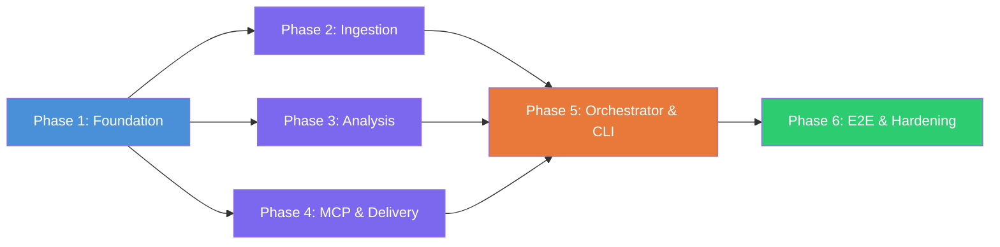

# Weekly Product Review Pulse — Implementation Plan

> **Version:** 1.0 · **Date:** 2026-05-04
> **Companion docs:** [architecture.md](./architecture.md) · [problem_statement.md](./problem_statement.md)

---

## Phase Overview

| Phase | Name | Duration | Key Deliverable |
|---|---|---|---|
| **1** | Foundation & Data Models | 3 days | Project scaffold, config, Pydantic models, SQLite run log, CLI skeleton |
| **2** | Review Ingestion Pipeline | 4 days | App Store + Play Store scrapers, PII scrubber, cached test fixtures |
| **3** | Analysis & Clustering Engine | 5 days | Embeddings → UMAP → HDBSCAN → LLM summariser → quote validator |
| **4** | MCP Integration & Delivery | 5 days | MCP client layer, Docs append, Gmail send, idempotency checks |
| **5** | Rendering, Orchestrator & CLI | 3 days | Jinja2 templates, orchestrator loop, full CLI, scheduler |
| **6** | End-to-End Testing & Hardening | 4 days | Integration tests, dry-run mode, error recovery, production config |

**Total estimated duration: ~24 days** (single developer, sequential)

---

## Phase 1 — Foundation & Data Models

### Objective
Set up the project structure, configuration system, data models, and audit store so all subsequent phases have a stable foundation.

### Tasks

| # | Task | Module | Output |
|---|---|---|---|
| 1.1 | Initialize Python project (`pyproject.toml`, virtual env, linting) | Root | `pyproject.toml` with all deps declared |
| 1.2 | Create directory structure per architecture §3.1 | All | Folder tree with `__init__.py` files |
| 1.3 | Implement `config.py` — load and validate `config.yaml` | `agent/config.py` | `AppConfig` Pydantic model |
| 1.4 | Define all Pydantic data models | `store/models.py` | `Review`, `Theme`, `AnalysisResult`, `RunRecord` |
| 1.5 | Implement SQLite run log (create table, insert, query) | `store/run_log.py` | `RunLog` class with async CRUD |
| 1.6 | Implement idempotency checker (local DB layer) | `agent/idempotency.py` | `check_run_exists()`, `mark_run_complete()` |
| 1.7 | CLI skeleton with `run` and `status` commands | `cli.py` | Click CLI that parses `--product` and `--week` |
| 1.8 | Create sample `config.yaml` for all 5 products | Root | Working config with real App/Play Store IDs |

### Exit Criteria
- `python -m review_pulse run --product groww --week 2026-W18` parses args and logs "run starting" without error.
- `RunLog` can insert and retrieve a record; `UNIQUE(product, iso_week)` constraint verified.
- All Pydantic models serialise/deserialise correctly.
- See: [Phase 1 Evaluations](./evaluations/phase1_evaluations.md) · [Phase 1 Edge Cases](./edge_cases/phase1_edge_cases.md)

---

## Phase 2 — Review Ingestion Pipeline

### Objective
Fetch, normalise, deduplicate, and PII-scrub reviews from both stores for any configured product.

### Tasks

| # | Task | Module | Output |
|---|---|---|---|
| 2.1 | Define `ReviewSource` abstract base class | `ingestion/base.py` | ABC with `fetch_reviews(product, window) → list[Review]` |
| 2.2 | Implement App Store scraper | `ingestion/appstore.py` | `AppStoreSource` — fetches via RSS / web scraper |
| 2.3 | Implement Play Store scraper | `ingestion/playstore.py` | `PlayStoreSource` — fetches via `google-play-scraper` |
| 2.4 | Implement PII scrubber (regex + optional Presidio) | `ingestion/pii_scrubber.py` | `scrub(text) → cleaned_text` |
| 2.5 | Wire ingestion into orchestrator stub | `agent/orchestrator.py` | `ingest()` method returns `list[Review]` |
| 2.6 | Create test fixtures (cached JSON responses) | `tests/fixtures/` | 50+ reviews per store, per product |
| 2.7 | Review deduplication by `review_id` | `ingestion/base.py` | Dedupe logic in base class |
| 2.8 | Graceful degradation when one source fails | `ingestion/base.py` | Log warning, return partial results |

### Exit Criteria
- `ingest("groww", window_weeks=12)` returns ≥20 normalised `Review` objects from at least one source.
- PII scrubber replaces seeded emails/phone numbers with `[EMAIL]`/`[PHONE]` tags.
- Re-running with cached fixtures returns identical count (deduplication verified).
- See: [Phase 2 Evaluations](./evaluations/phase2_evaluations.md) · [Phase 2 Edge Cases](./edge_cases/phase2_edge_cases.md)

---

## Phase 3 — Analysis & Clustering Engine

### Objective
Turn raw reviews into structured themes with validated quotes and action recommendations.

### Tasks

| # | Task | Module | Output |
|---|---|---|---|
| 3.1 | Implement embedding generator | `analysis/embeddings.py` | `embed(reviews) → np.ndarray` using `all-MiniLM-L6-v2` |
| 3.2 | Implement UMAP dimensionality reduction | `analysis/clustering.py` | `reduce(embeddings) → np.ndarray` (384d → 15d) |
| 3.3 | Implement HDBSCAN clustering | `analysis/clustering.py` | `cluster(reduced) → labels[]` |
| 3.4 | Implement full clustering pipeline | `analysis/clustering.py` | `ClusteringPipeline.run(reviews) → ClusterResult` |
| 3.5 | Implement LLM summariser | `analysis/llm_summariser.py` | Per-cluster: theme name, quotes, action idea |
| 3.6 | Implement quote validator | `analysis/validation.py` | `validate_quotes(quotes, source_texts) → list[ValidatedQuote]` |
| 3.7 | Implement token budget tracker | `analysis/llm_summariser.py` | Abort if cumulative tokens exceed `max_tokens_per_run` |
| 3.8 | Implement fallback for 0-cluster scenario | `analysis/clustering.py` | TF-IDF top-N keyword fallback |
| 3.9 | Wire analysis into orchestrator | `agent/orchestrator.py` | `analyse(reviews) → AnalysisResult` |

### Exit Criteria
- Given 100 fixture reviews, pipeline produces ≥2 clusters with named themes.
- Every quote in `AnalysisResult` passes exact-substring validation against source review bodies.
- Token usage is tracked and hard-limited per config.
- 0-cluster fallback triggers correctly with <10 very diverse reviews.
- See: [Phase 3 Evaluations](./evaluations/phase3_evaluations.md) · [Phase 3 Edge Cases](./edge_cases/phase3_edge_cases.md)

---

## Phase 4 — MCP Integration & Delivery

### Objective
Connect the agent to Google Docs and Gmail MCP servers, implement idempotent delivery.

### Tasks

| # | Task | Module | Output |
|---|---|---|---|
| 4.1 | Implement `MCPClientManager` (connect, call_tool, disconnect) | `delivery/mcp_client.py` | Generic async MCP client |
| 4.2 | Load MCP server config from `mcp_servers.json` | `delivery/mcp_client.py` | Parse server commands & env vars |
| 4.3 | Implement Docs delivery — create doc if needed | `delivery/docs_delivery.py` | `ensure_doc_exists(product) → doc_id` |
| 4.4 | Implement Docs delivery — read headings for idempotency | `delivery/docs_delivery.py` | `heading_exists(doc_id, week) → bool` |
| 4.5 | Implement Docs delivery — append section | `delivery/docs_delivery.py` | `append_section(doc_id, payload) → heading_anchor` |
| 4.6 | Implement Gmail delivery — create draft | `delivery/gmail_delivery.py` | `create_draft(email_payload) → draft_id` |
| 4.7 | Implement Gmail delivery — send draft | `delivery/gmail_delivery.py` | `send_draft(draft_id) → message_id` |
| 4.8 | Implement Gmail idempotency — check sent messages | `delivery/gmail_delivery.py` | `already_sent(product, week) → bool` |
| 4.9 | Create `mcp_servers.json` template | Root | Template with placeholder paths |
| 4.10 | MCP connection health check at agent boot | `delivery/mcp_client.py` | Fail-fast if server unreachable |

### Exit Criteria
- Agent connects to both MCP servers via stdio and lists available tools.
- `append_section()` adds a section to a test Google Doc; second call with same week is idempotently skipped.
- `create_draft()` produces a draft in Gmail; `already_sent()` correctly detects it after sending.
- See: [Phase 4 Evaluations](./evaluations/phase4_evaluations.md) · [Phase 4 Edge Cases](./edge_cases/phase4_edge_cases.md)

---

## Phase 5 — Rendering, Orchestrator & CLI

### Objective
Build the report templates, wire the full orchestrator pipeline, and complete the CLI/scheduler.

### Tasks

| # | Task | Module | Output |
|---|---|---|---|
| 5.1 | Create Jinja2 template for Google Doc section | `rendering/templates/doc_section.j2` | Template producing Docs batchUpdate JSON |
| 5.2 | Create Jinja2 templates for email (HTML + plain text) | `rendering/templates/email.html.j2`, `email.txt.j2` | Email body templates |
| 5.3 | Implement `doc_renderer.py` | `rendering/doc_renderer.py` | `render_doc_section(result) → DocPayload` |
| 5.4 | Implement `email_renderer.py` | `rendering/email_renderer.py` | `render_email(result, doc_link) → EmailPayload` |
| 5.5 | Complete orchestrator main loop | `agent/orchestrator.py` | Full ingest → analyse → render → deliver → log |
| 5.6 | Implement `run` CLI command (full pipeline) | `cli.py` | `--product`, `--week`, `--dry-run` flags |
| 5.7 | Implement `backfill` CLI command | `cli.py` | `--product`, `--from-week`, `--to-week` |
| 5.8 | Implement `status` CLI command | `cli.py` | Pretty-print recent runs from SQLite |
| 5.9 | Implement APScheduler cron wrapper | `scheduler.py` | Monday 08:00 IST trigger per product |
| 5.10 | Implement `--dry-run` mode (skip delivery) | `agent/orchestrator.py` | Render but do not call MCP |

### Exit Criteria
- `python -m review_pulse run --product groww --week 2026-W18 --dry-run` completes the full pipeline and prints the rendered report without calling MCP.
- Full (non-dry-run) execution appends to the Google Doc and sends/drafts an email.
- `backfill --from-week 2026-W15 --to-week 2026-W18` processes 4 weeks sequentially.
- `status` shows a formatted table of past runs.
- See: [Phase 5 Evaluations](./evaluations/phase5_evaluations.md) · [Phase 5 Edge Cases](./edge_cases/phase5_edge_cases.md)

---

## Phase 6 — End-to-End Testing & Hardening

### Objective
Validate the full system with real data, harden error handling, and prepare for production.

### Tasks

| # | Task | Module | Output |
|---|---|---|---|
| 6.1 | End-to-end test: single product, single week | All | Green run producing real Doc section + email draft |
| 6.2 | End-to-end test: idempotent re-run | All | Second run skips Doc append + email send; run log shows "idempotent skip" |
| 6.3 | End-to-end test: multi-product backfill | All | 3+ products × 2 weeks = 6 successful runs |
| 6.4 | Error recovery: simulate ingestion failure | `ingestion/*` | Partial-source graceful degradation verified |
| 6.5 | Error recovery: simulate MCP server crash | `delivery/*` | Retry logic; clean failure + audit log |
| 6.6 | Error recovery: simulate LLM quota exceeded | `analysis/*` | Exponential backoff; eventual failure logged |
| 6.7 | Performance profiling | All | Full run <5 min for single product |
| 6.8 | Security audit — no creds in codebase | All | `grep` scan for credential patterns |
| 6.9 | Documentation — README, setup guide, runbook | Root | `README.md`, `SETUP.md` |
| 6.10 | Production config template | Root | `config.prod.yaml` with all 5 products |

### Exit Criteria
- All 5 products run successfully for a given week with real (non-cached) data.
- Idempotent re-run produces zero side effects.
- MCP server crash during delivery is retried once and cleanly logged on failure.
- No credential strings found anywhere in the codebase.
- See: [Phase 6 Evaluations](./evaluations/phase6_evaluations.md) · [Phase 6 Edge Cases](./edge_cases/phase6_edge_cases.md)

---

## Dependency Graph

> **Phases 2, 3, 4 can be developed in parallel** after Phase 1 is complete. Phase 5 integrates all three. Phase 6 validates the whole.

---

## Risk Register

| Risk | Impact | Mitigation |
|---|---|---|
| App Store anti-scraping blocks | Ingestion fails for iOS reviews | Fall back to iTunes RSS feed; add retry with delay |
| HDBSCAN produces only noise for sparse review sets | No themes generated | TF-IDF fallback (Phase 3, Task 3.8) |
| MCP server API changes | Delivery breaks | Pin MCP server versions in `mcp_servers.json` |
| LLM hallucinated quotes | Trust erosion in report | Quote validator (Phase 3, Task 3.6) catches 100% of hallucinations |
| Google API rate limits | Delivery throttled | Batch updates; exponential backoff |
| OAuth token expiry mid-run | MCP calls fail | MCP server handles refresh; agent retries on auth error |
